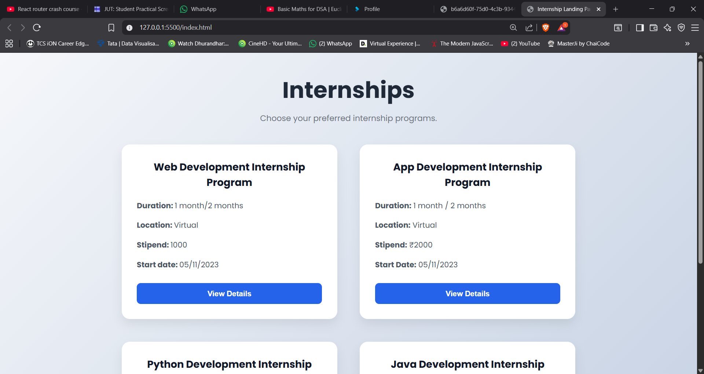

# Internship Landing Page

A modern and responsive Internship Landing Page built using HTML and CSS. This project showcases different internship programs using clean card-based layouts, responsive design, and interactive buttons.

## 🚀 Features

- Responsive card layout
- Clean and modern UI
- Hover effects on cards and buttons
- Mobile-friendly design
- External links for internship details
- Built with semantic HTML5 and CSS3

## 🛠️ Technologies Used

- HTML5
- CSS3

## 📂 Project Structure

```
internship-landing-page/
│
├── images
|      └── project-preview.png
├── index.html
├── style.css
└── README.md
```

## 📸 Preview




## 📌 Internship Programs

- Web Development Internship
- App Development Internship
- Python Development Internship
- Java Development Internship

## 📖 Learning Outcomes

While building this project, I practiced:

- Semantic HTML
- CSS Grid
- Flexbox
- Responsive Web Design
- CSS Transitions
- Modern UI Design

## 👨‍💻 Author

**Kaushal Kumar**

GitHub: https://github.com/kaushalvivek2005